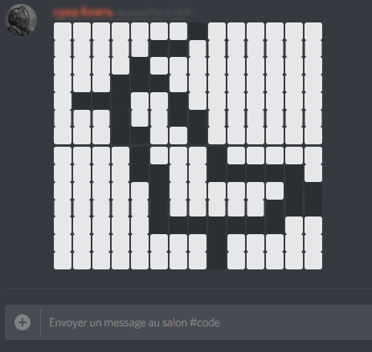

# DiscordPainter
Simple tool to create black and white, 14x14, drawings for Discord (using large_square)

Editor:

Result in Discord:

The output is sent to the console. It is split in 2 parts because of the 2000 characters limitation, so copy/paste one half at a time. 
